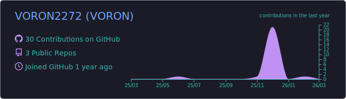

  

<h3 align="center">Hi, I'm VORON — System Administrator & Budding Developer</h3>

  

---

### 👨‍💻 About Me

I am a **System Administrator** expanding my expertise into software development. With a solid foundation in Python, I am currently diving deep into Frontend technologies and Database management.

- 🔭 **Current Project:** Working on [Dev Space](https://github.com/VORON2272/Dev-Space).
- 🌱 **Learning Path:** Mastering **HTML5, CSS3, JavaScript, and MySQL**.
- ⚙️ **Core Experience:** Linux OS, Server Administration, and Bash scripting.
- ⚡ **Personal Site:** [infome-voron.ru](https://infome-voron.ru/)

---

### 🛠️ Technical Stack

  
  
  
  
  
   
  
  
  
  

---

### 📊 GitHub Analytics

  
  
  
    

  
  
  
   

